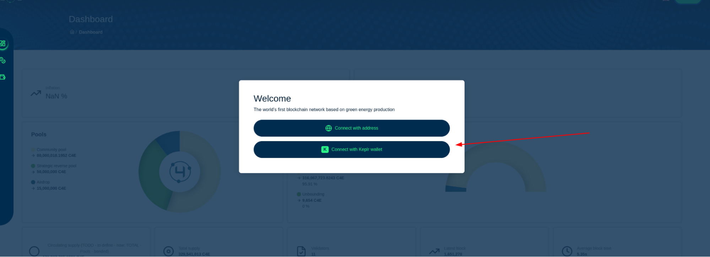
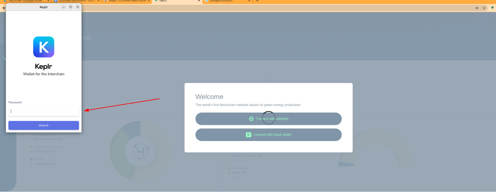

<!--
   παραγγελία: 5
-->

# Αυθεντικοποίηση

Αυτή τη στιγμή το web wallet C4E υποστηρίζει 2 τύπους ελέγχου ταυτότητας.
1. [Χρήση του πορτοφολιού Keplr](#authentication-via-keplr-extension);
2. [Χρήση διεύθυνσης χρήστη (διαθέσιμο μόνο για υπάρχοντες χρήστες)](#authentication-via-user-address);

Αφού διαβάσετε το εισαγωγικό υλικό, μεταβείτε στα [βασικά] (../validatorsGuide/basics/README.md) για να μάθετε περισσότερα.

### Έλεγχος ταυτότητας μέσω επέκτασης Keplr:

1. Μεταβείτε στην ιστοσελίδα C4E-wallet
2. Στην επάνω δεξιά γωνία κάντε κλικ στο «Σύνδεση»

3. Επιλέξτε "Σύνδεση με Keplr"

4. Εισαγάγετε τον κωδικό πρόσβασής σας στο ανοιχτό παράθυρο Keplr

5. Εγκρίνετε τη σύνδεση κάνοντας κλικ στο «Έγκριση».

6. Η διεύθυνσή σας θα εμφανιστεί στην επάνω δεξιά γωνία της εφαρμογής

Μπορείτε να το χρησιμοποιήσετε για σύνδεση μέσω "Διεύθυνση χρήστη"

7. Έχετε συνδεθεί

### Έλεγχος ταυτότητας μέσω διεύθυνσης χρήστη:

**!Σημαντικό:** Η σύνδεση μέσω της διεύθυνσης χρήστη είναι διαθέσιμη σε λειτουργία θεατών **μόνο**, Δεν θα μπορείτε:

1. Κάντε συναλλαγές
2. Αντιπροσώπευση, ανανέωση ή εκ νέου ανάθεση κουπονιών.
3. Ψηφοφορία.

**Σημείωση: αυτή η επιλογή είναι διαθέσιμη μόνο για ήδη υπάρχοντες χρήστες. Δείτε Έλεγχος ταυτότητας μέσω της επέκτασης Keplr εάν δεν έχετε συνδεθεί στο παρελθόν. **

**Επίσης, ο χρήστης που έχει λιγότερο από 0,000001 διακριτικό δεν μπορεί να συνδέσει το σύστημα με αυτήν τη μέθοδο ελέγχου ταυτότητας.**

Για να συνδεθείτε με τη διεύθυνση χρήστη, πρέπει να κάνετε τα ακόλουθα βήματα:

1. Μεταβείτε στην ιστοσελίδα του πορτοφολιού C4E
2. Στην επάνω δεξιά γωνία κάντε κλικ στο «Σύνδεση»

3. Επιλέξτε "Σύνδεση με διεύθυνση"

4. Μετακινήστε τη διεύθυνση χρήστη σας στο παράθυρο που ανοίγει και κάντε κλικ στο "Σύνδεση"

5. Έχετε συνδεθεί

**Σημείωση: η σύνδεση μέσω του λογαριασμού Keplr δεν δημιουργεί αυτόματα χρήστη. Για να μπορεί να συνδεθεί μέσω της Διεύθυνσης Χρήστη, ο χρήστης πρέπει να έχει τουλάχιστον 0,000001 μάρκες C4E πρώτα·**

## Επόμενο {απόκρυψη}
