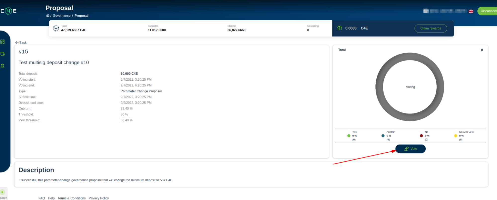
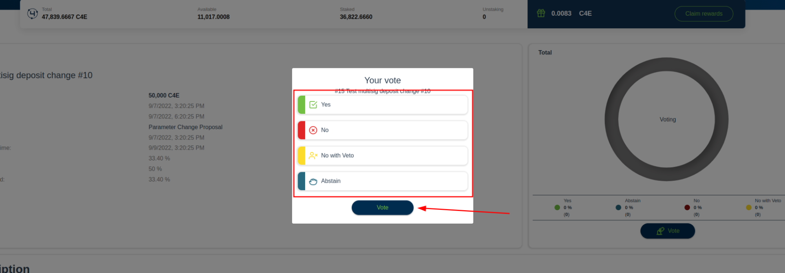

# Governance

In governance users can see different proposals and vote for them. Options of voting are available to users that have staked tokens. Stacked tokens are the measurement of  voting power.

**!Remember only tokens that are staked in validators at the end of the voting period will be counted in the final voting decision. **

To vote user have to be Loged in and have some token stacked inside validators;

To vote follow the next steps:

1. Go to “[governace](https://wallet.c4e.io/governance)” page in wallet application;
2. Find proposal that you want to vote;

3. Make sure this proposal is not ended;
4. Click on proposal to go in proposals
5. On proposals details page click “Vote”

6. Choose your voting option

7. Inside Keplr window click Approve;

    !Note if you are using Ledger way of login you have to approve the action by Ledger

8. Voting is done
