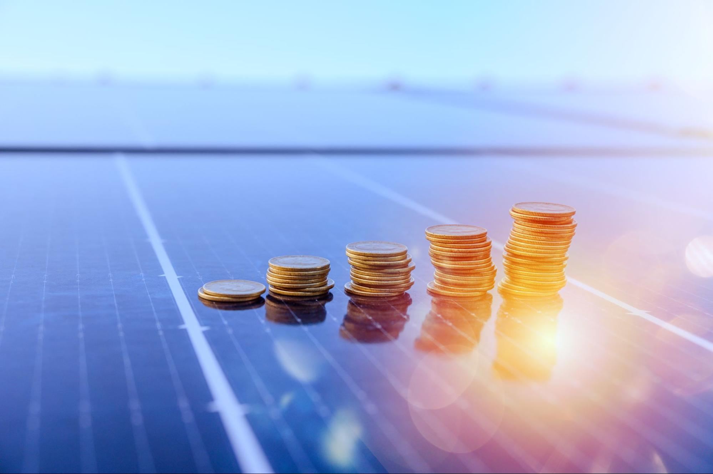
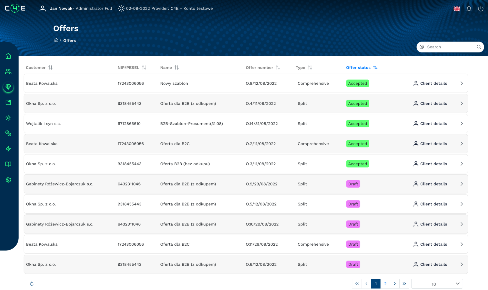

<!--
  order: 4
-->
# LAYER 2 - Energy Acquisition & Billing Automation

To ensure the handling of the above-mentioned use cases, it is necessary to properly manage all types of green market participants, their acquisition, settlement and ongoing support for the produced and consumed energy. We have created a comprehensive and technologically unique solution containing the mechanisms of flexible CRM, billing automation with invoicing related to automation and data analysis, integrated with global energy exchanges, automatic data collection from energy distributors and smart meters.

Thanks to the "Energy acquisition & billing automation" energy trading companies can generate leads, attract and provide comprehensive services to customers in terms of sales and purchase of energy, thus obtaining energy for its further trading. A specially designed web and mobile application for both the company and the user with 24/7 access will ensure maximum customer & energy management.

Main features supported by the application:

* Web and mobile application with a personal C4E wallet for managing energy tokens.
* Lead generation and energy acquisition processes also with digital agreements (eIDAS) and support for the (TPA) processes of switching the energy supplier. Full support for customers (retail & B2B)
* Real time monitoring of energy production and consumption
* An extensive and flexible product catalog fully managed by energy trading companies
* Settlement of energy purchase and sale with full automation of billing processes, collection of data from smart meters and data from local energy distributors.
* A full range of analytical, forecasting and reporting possibilities

This module is also responsible for rewarding active participants of the green energy market. Based on the amount of produced energy the producer receives a C4E Token as a reward as well as dedicated benefits from trading suppliers (e.g. a discount on the purchase of photovoltaic panels)

The customer & energy acquisition module as the heart of the solution where all automatic operations and processes take place, provides the necessary customer and energy data to the next smart grid components.
