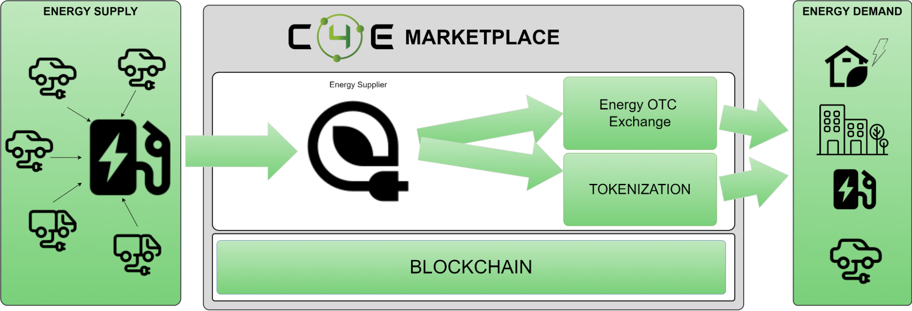
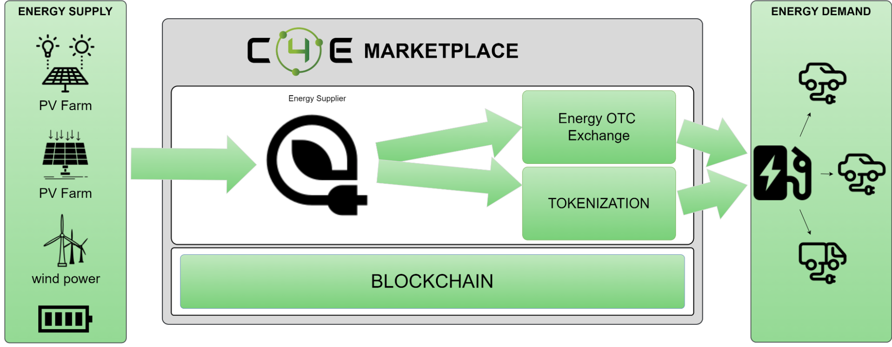

<!--
  order: 5
-->

# LAYER 3 - Smart Grid Components

The Smart Grid component layer is the key and goal of the entire C4E WEB 3.0 Energy Marketplace. We provide unique products that define modern business models for all participants of the distributed energy market.

Thanks to the implemented products of layer 3, we deliver the necessary mechanisms to handle advanced energy use cases such as: energy trading, aggregation, balancing and energy tokenization necessary to support the charging of electric cars, virtual prosumer or preventing global and local energy poverty.

##

### ENERGY TRADING

C4E WEB 3.0 Energy Marketplace enables trading in the most efficient way. This trading module supports OTC trading transactions between energy suppliers and B2B on the SPOT and Futures markets. The solution also supports P2P sales in neighborhoods or within energy communities with use of unique mechanisms of energy trading through modern settlement methods - energy tokenization.

Main features of the OTC energy trading module:

* Online energy trading 24/7 using a modern web application.
* SPOT and Futures transactions
* Support for the Brokerage House
* Integration with energy storages
* Competitive energy price and low transaction fees

Thanks to the use of the blockchain network and the dAPPs dedicated to energy trading we have created, the system enables transactions concluded with the use of FIAT currencies as well as transactions on tokenized energy. Tokenized energy tokens traded on the OTC Energy Trading platform are used for settlement of prosumers, virtual prosumers, collective prosumers, energy communities and charging electric cars.

### ENERGY BALANCING

Energy balance is one of the Chain4Energy Marketplace modules which, in conjunction with smart meters and integrated with the C4E energy exchange, allows for:

* Providing the necessary information on energy supply and demand in real time
* Providing short, medium and long-term forecasts of energy demand and production
* Monitoring and flexible management of flows
* Trading in energy surplus
* Energy aggregation

### MICROGRID - ENERGY COMMUNITIES

A microgrid is a local energy grid with control capability, which means it can disconnect from the traditional grid and operate autonomously[^1].

Microgrids contain one or more types of distributed energy (solar panels, wind turbines, combined heat and power plants, generators) that produce its power. And more and more often it includes energy storage and charging stations for electric vehicles.

Tools that will allow you to balance, tokenize and trade energy in the area of multi-apartment houses, housing estate, district, commune, city will play a key role in the entire energy ecosystem in the future.

We are providing a decentralized marketplace for decentralized energy sources and distributed energy consumption. Supporting and encouraging energy balancing (i.e. demand and supply management) on the local energy market (LEM). It is extremely crucial to offload a distribution network which isn’t prepared for such kind of “traffic”. Our solution by design is integrated with the Smart House Solution to manage energy.

Prosumers and consumers, being part of a micro-grid, become participants in the energy market and can buy / sell energy on local energy markets. Trading Peer2peer, energy tokenization gives possibilities to settle energy usage by community members. In case of trading with Access to the Energy Trading module and integration with energy storage and appropriate tools for sales automation, it provides the best selling price for energy, and the buyer with the best purchase price along with a guarantee of energy origin in the hourly settlement.

Through DAO, micro-grids/energy communities can form sovereign organizations to manage them and trade with other communities and the retail market. This is extremely valuable for small communities such as a collective prosumer in a multi-family building.

### MULTI-ENERGY MICRO GRIDS SYSTEM

The multi-energy micro grids systems (MEMGS) is an answer to build a new kind of energy infrastructure and create a path to transform existing one. MEMGS consist of multiple microgrids and a variety of energy forms. The whole system manages distributed power sources, energy storage devices, and loads as the main body, and aggregates small-scale distributed energy through local energy management systems and adjacent loads. The trading system allows interaction between regional microgrids and upper-level energy supply networks. The energy management that has to be done parallel to the energy trading reflects mostly the “source-storage-load”. In case of the massive deployment of the distributed energy generation, energy storages and active loads, we have to have various perspective of energy network, optimal smart-home, optimal management of single microgrid, collaborative optimal configuration of MEMGS according to the energy demand of multiple micro-grids in the region, considering the interaction of microgrids with energy supply network. 

### ELECTROMOBILITY

Electromobility is a very broad and complex topic. In our project, we want to bring it to a user-friendly space for easy and transparent handling of electromobility needs. Based on an energy wallet that functions like a bank account, where the client can monitor home energy consumptions and decide about their energy surplus which could be transferred in P2P formula, passed on deposit account or used, for example, to charge an electric car. Additional rewards for the green energy production, could be used similarly to other well known loyalty programs.

We decided to focus on the following topics that use similar functionalities:

* Car charging with tokenized energy
* Electromobility management
* Vehicle To Grid (V2G)

EV can be placed on the supply or demand side depending on its current role. On the one hand, the owner of an electric car can use cheap renewable energy sources from the sun, wind and water to charge the car. On the other hand, its battery can be used as energy storage or a source of green energy when the grid or micro grid needs these resources. Settlement for EV resources can be made in the form of tokens in non-cash transactions

<table>
  <tr>
   <td><strong>EV - energy supply side</strong>
   </td>
   <td><strong>EV - energy demand side</strong>
   </td>
  </tr>
  <tr>
   <td>

   </td>
   <td>

   </td>
  </tr>
</table>

### ENERGY TOKEN

Our ambition is to provide tools for a fully decentralized peer-to-peer (P2P) energy token market for small scale prosumers, energy sources, energy suppliers using blockchain technology in a smart grid environment. Using smart contracts, all sellers and buyers in the local market can engage in bilateral energy token transactions (P2P) with each other under an agreed price.

Tokenized energy can be also freely exchanged between wallets. We can imagine the situation where a prosumer can replace part of his balance stored in the prosumer's wallet to Energy Token and send it to a friend or family (EV owner) to charge the EV. EV owners can use Energy Tokens to pay for energy. The charging station can “redeem” energy tokens to pay for energy from the Energy supplier.

Above scenario is presented at following diagram in 4 simple steps:

* Mint Energy Token
* Transfer Energy Token
* Use Energy Token
* Burn Energy Token

Having an energy token which represents energy 1-1 is a dream for everyone. Everyone is aware how energy prices are skyrocketing (especially in Europe). The energy market value is very fragile and from the physical perspective, most of the energy produced has to be immediately consumed. The energy price highly depends on many factors and especially demand/response at the specific time. Such conditions create business risk for the e.g. energy supplier.

This risk can be described as a cost value function from time. This mechanism is called Demurrage (fractal burning in time). This mechanism prevents the local prosumers from collecting energy tokens and encourages them to utilize them as quickly as possible.

Each energy supplier can apply its own demurrage rules, which are stored in the smart contract. 

## Next {hide}
