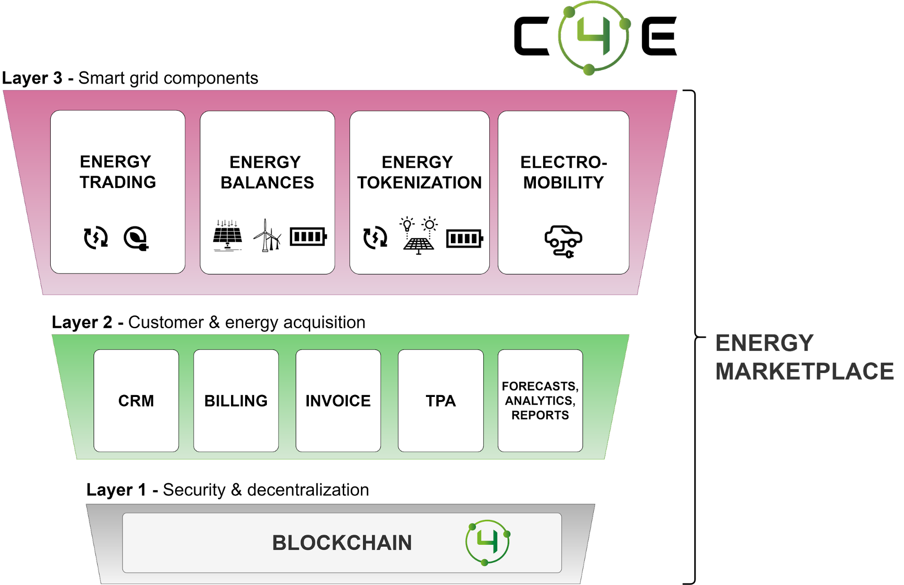

<!--
  order: 2
-->
# Energy Marketplace

The C4E platform is built on the basis of 3 layers constituting the foundation thanks to which it is possible to manage customers, energy and implement modern business models for the entire renewable energy market:

* Layer 1 - [SECURITY & DECENTRALIZATION](sec.md)
* Layer 2 - CUSTOMER & ENERGY ACQUISITION,
* Layer 3 - SMART GRID COMPONENTS.

Individual investors and users of the Chain4Energy platform will be able to gain, apart from endless product possibilities, also access to a friendly mobile application, which will be the management center for the energy they generate and consume. By combining a mobile application, energy and C4E tokens, each producer and consumer receives both an energy management panel and a modern energy wallet with unique functionalities from both the business world and blockchain.

## Next {hide}

Get an high-level [overview](README.md) of Ethermint {hide}
