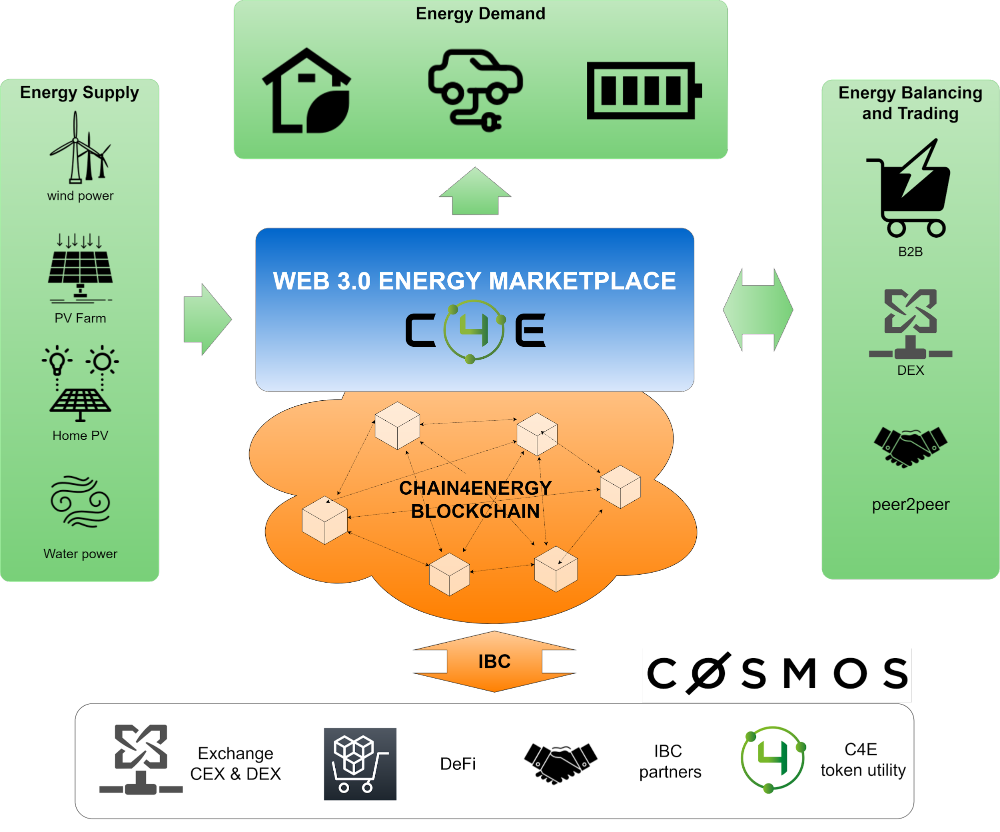

<!--
  order: 3
-->

# Layer 1 - Security and decentralization

The Blockchain network is a solid foundation on which the Chain4Energy ecosystem is based. It is already widely used and has influenced many business sectors around the world; finance, healthcare, insurance and shopping. The energy sector is inevitably another sector since the market is undergoing a thorough transformation from centralized to decentralized solutions. Blockchain is an ideal technology that allows you to effectively manage, balance, trade and track various aspects of energy.

CØSMOS ecosystem

After solid analysis, we decided to build a sovereign app specific blockchain. This gives us the greatest flexibility and a guarantee that we will be able to provide a solution tailored to the requirements and expectations of such a critical sector as the power industry. However, this cannot be an island, detached from a world where everything has to be built from scratch. It has to be a blockchain that is easily able to integrate with other projects / networks so that you can easily use the values provided by partners.

Chain4Energy is an app specific blockchain for green energy use cases. We decided to build our project based on the Cosmos SDK as a one of Cosmos HUB chain supporting IBC (Inter Blockchain Communication) being one of the planets among ATOM, OSMO, JUNO, EVMOS etc.

The Cosmos-SDK is an open-source framework for building multi-asset public Proof-of-Stake (PoS) blockchains like the Cosmos Hub, as well as permissioned Proof-Of-Authority (PoA) blockchains. The COSMOS ecosystem is an open space that enables the development of a vast number of other projects which could cooperate together by Inter Blockchain Communication (IBC), generating further values and creating additional opportunities.

[comment]: <> (![alt_text]&#40;./images/map.png "image_tooltip"&#41;)

Security and decentralization

Proof-of-Stake (PoS) consensus algorithms increase blockchain network performance by eliminating the energy-intensive computational mining process inherent in Proof-of-Work protocols. PoS algorithms encourage users to validate networka data and ensure security through the staking process. [Delegated Proof of Stake (DPoS)](https://101blockchains.com/delegated-proof-of-stake-dpos/) works similarly, but includes a voting and delegation mechanism that makes the process more democratic.

Our blockchain uses DPoS, thus giving everyone a chance to secure and influence the development of the ecosystem through DAO (Decentralized Autonomous Organization).

Chain4Energy cooperates with two types of validators:

1. Professional web3 validators who have experience and have a thorough understanding of the market economy and the value of the staking business;
2. B2B (e.g. Energy Trading Companies) that are users of the product. As a validator, they can lower the cost of the product and at the same time have an impact on the roadmap based on the voting power they have in the DAO

Applications

This layer consists of Applications supporting blockchain like wallet, explorer and decentralized application dApps. Decentralized applications run directly in the blockchain, implemented as modules included in the validator node or Smart Contracts using [CosmWasm](https://cosmwasm.com/). Applications can be implemented by anyone (we are inviting builders to take advantage of our ecosystem). However, in order for them to work, they must be approved by the DAO on the basis of a vote.

Thanks to this approach to building a solution, we can develop a community-based ecosystem while maintaining the highest quality required by the energy sector. The community (token owners) will have a huge influence in driving the development of the project.

As part of our project, we need to build a number of applications and dApps that are necessary for the operation of the second and third layer of our stack.

* Fingerprint - the fingerprint of document (contract, agreement, offer etc.) exchanged between users of the system. The fingerprint is a proof.
* Energy Token - dApp enabling minting, distributing, burning tokens which represents physical energy or voucher. This module enables tokenization of energy.
* Energy DEX - Decentralized Exchange which enables trading of energy tokens, crypto and stablecoins for the energy market participants.
* Wallet - a wallet tailored to non crypto users which fills the gaps between crypto and energy market.
* Explorer - Explorer allowing to track all transactions and verify the state of the blockchain.
* REC - Renewable Energy Certificates with proof of green energy production. Minting based on Proof of Green Energy, distribution and burning mechanism secured by blockchain immutability.
* Staking - staking module for delegators.
* Farming - incentive for liquidity providers in DEX Liquidity Pools.
* DAO - Governance module
* Decentralized storage - For the project to be truly decentralized, the solution also needs to provide a method of secure data storage, incl. contracts, offers in a decentralized manner, but compliant with the GDPR.
* eIDAS - Digital signature
* DID - Decentralized identities which are WEB3 standard compliant
* Smart Metering - implementation that allows you to connect smart meters to the blockchain ensuring non-repudiation and data security. These can be dedicated devices or inverters of PV devices.
* And many many more …

## Next {hide}
