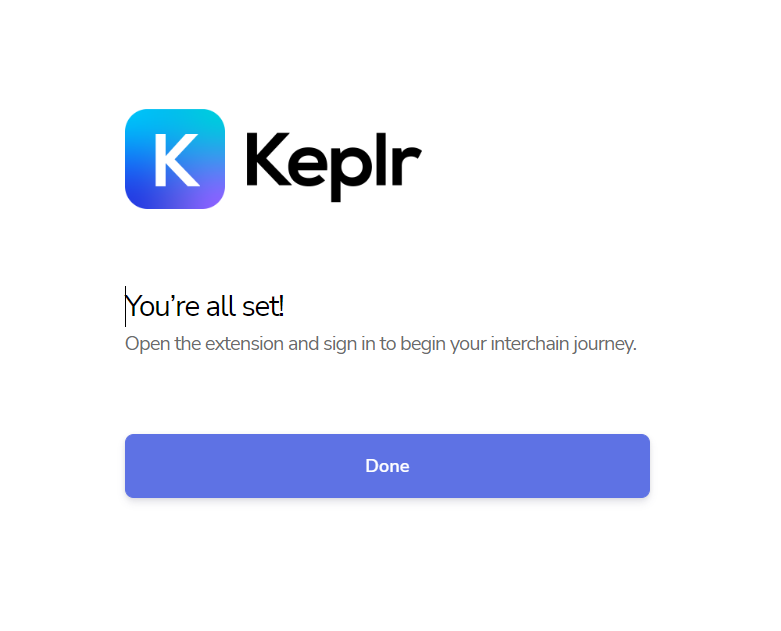

<!-- 
order: 8
-->
# Import Keplr account

If you Have an account you can import it in Keplr extension. To do it follow this steps:

1. Go to Keplr extension;
2. Select “Import existing account”

3. Pass your Mnemonic data (without it you can’t login, If you don’t have Mnemonic you have to create new account)

4. Create your Login and password.
5. Click next;Registration completed

