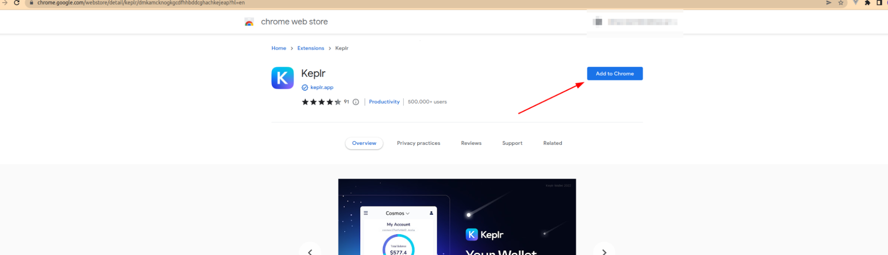
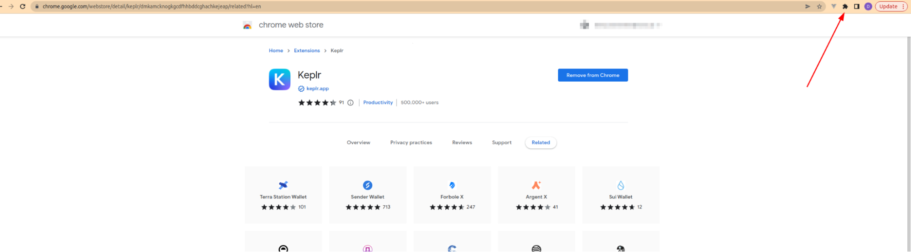

<!--
     παραγγελία: 7
-->
# Εγκατάσταση επέκτασης Keplr

Για να μπορέσετε να χρησιμοποιήσετε το σύστημα πρέπει να καταχωρήσετε έναν λογαριασμό.

Εγκατάσταση επέκτασης πορτοφολιού Keplr στο πρόγραμμα περιήγησής σας:

* Μεταβείτε στην [Επίσημη σελίδα επέκτασης Kepl](https://chrome.google.com/webstore/detail/keplr/dmkamcknogkgcdfhhbddcghachkejeap?hl=el)
* Πατήστε Προσθήκη στο chrome

* Επιβεβαιώστε την εγκατάσταση της επέκτασης

Είσοδος ή Είσοδος στο πορτοφόλι Keplr:

* Ανοίξτε τη λίστα επεκτάσεων πατώντας το κουμπί στην επάνω δεξιά γωνία

* Εάν έχετε ήδη λογαριασμό Keplr και έχετε μνημονικό σε αυτόν, απλώς συνδεθείτε στο πορτοφόλι Keplr πατώντας το κουμπί σύνδεσης:

* Εάν δεν έχετε λογαριασμό, υπάρχουν δύο επιλογές εγγραφής:
1. [Μέσω email](email.md);
2. Δημιουργία λογαριασμού.

## Επόμενο {απόκρυψη}
