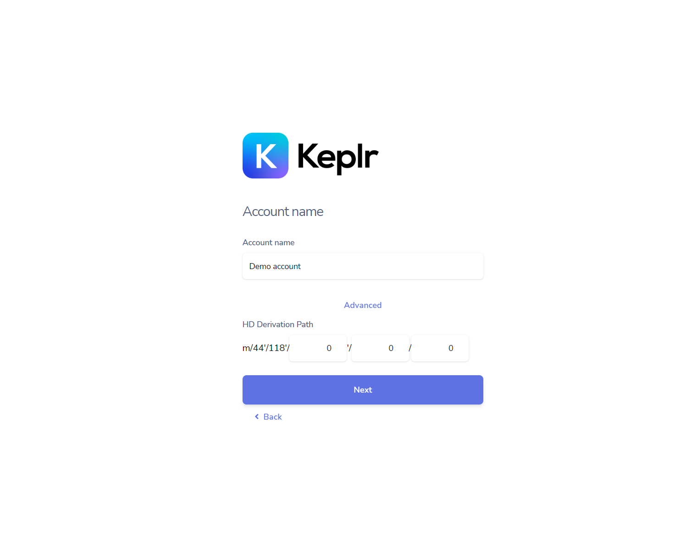

# Registration with Ledger

To use your physical Ledger user have to import Ledger inside the Keplr extension.

To choose this action user have to go through following steps:

1. User have to install the Cosmos (ATOM) app at ledger [https://support.ledger.com/hc/en-us/articles/360013713840-Cosmos-ATOM-?docs=true](https://support.ledger.com/hc/en-us/articles/360013713840-Cosmos-ATOM-?docs=true)
2. Open Keplr extension and chose “Import Ledger”

3. Create name for user and provide the path

4. Registration completed

## Next {hide}
