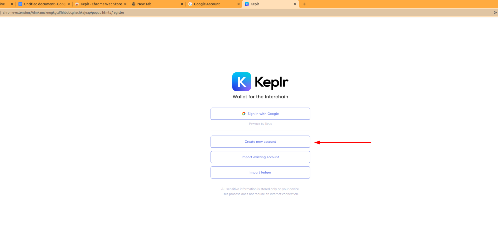

<!--
    order: 10
-->

# Registration without Email

1. Go to Keplr extension;
2. Select “Create new account”

3. In opened window create your Login and password.** **

   **!!! IMPORTANT: For next steps and to be able log in again in the future you have to remember the Mnemonic seed that is generated by Keplr. Please do not lose it;**

4. Press next;
5. If you’ve done everything right, new window should appear. In this window you have to choose the right order of mnemonic seed that was created in Step 3;

6. Registration completed

