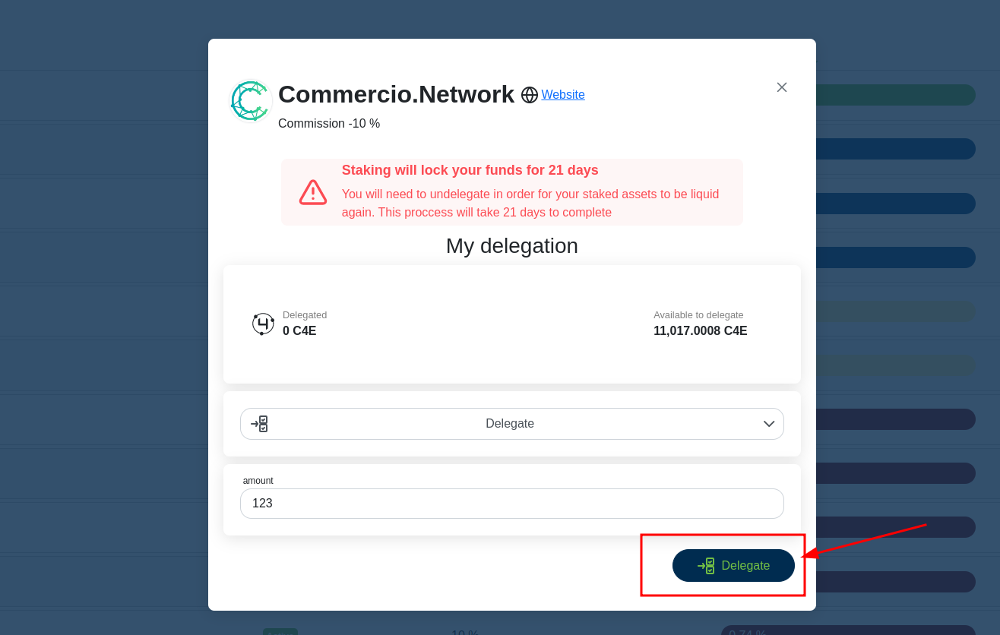
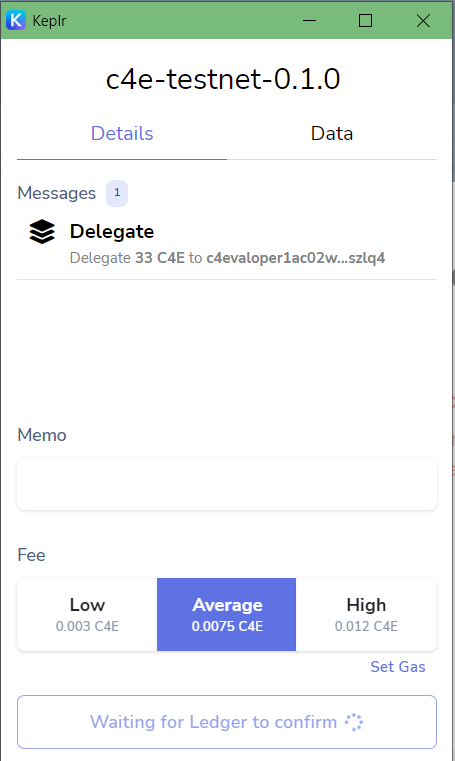

<!--
  order: 2
-->

# Delegate

Delegating tokens to validator allows you to vote in the system (See Voting for more info) also it allows you to get rewards from validator;

To delegate coins to validators you have to be Loged in with Keplr and should do the following steps:

1. Go to “[Staking](https://wallet.c4e.io/staking)” page and select the validator to stake

2. Click “Manage” on button;
3. In the action selection choose delegate:

4. In amount ut the amount of C4E tokens that should be delegated

5. Press “Delegate”

6. In opened Keplr window press Approve

    !Note if you are using Ledger way of login you have to approve the action by Ledger

7. Delegation done;

## Next {hide}
