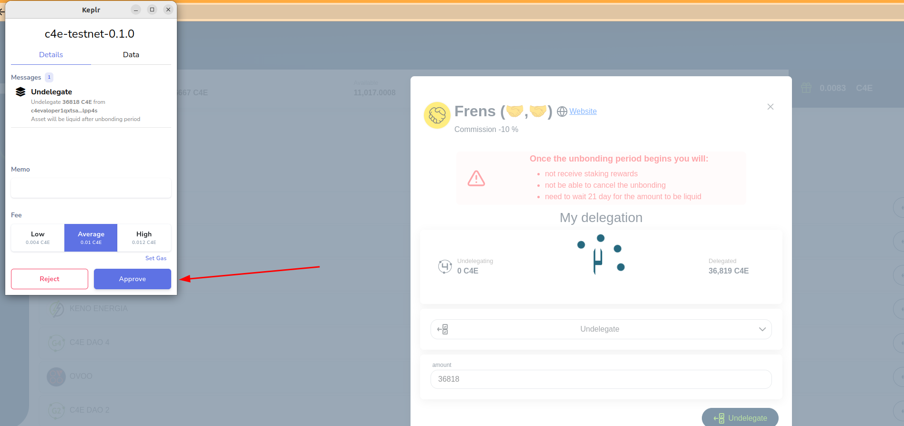

<!--
  order: 4
-->

# Undelegate

Undelegating tokens from validator can be done with validators that was delegated by user;

#### Undelegation restrictions

Undelegation amount can’t be more than previously delegated tokens

Complete undelegation is passing 21 day, so after undelegation started  user:

1. Will stop receiving staking rewards
2. Will not be able to cancel the unbonding
3. Will need to wait 21 day for the amount to be liquid

To undelegate coins from validators you have to be:

1.  LoggedIn with Keplr
2. Validator have to have delegated amount (user delegated tokens on this validator in the past)

To start undelegation process user have to:

1. Go to “Stacking” page and select the validator from which you will undelegate tokens;

2. Click “Manage” on button;
3. In the action selection choose “Undelegate”

4. Input amount that is less than “Delegated”
5. In opened Keplr window press Approve

    **!Note if you are using Ledger way of login you have to approve the action by Ledger**

6. Undelegation started;

## Next {hide}
